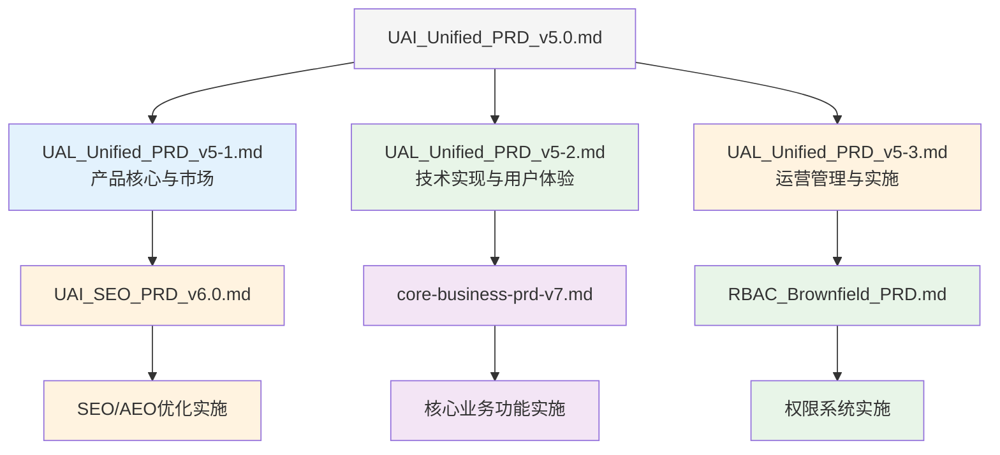

# UAI教育平台 - PRD管理文档

> 本文档统一管理UAI教育平台的所有产品需求文档，包括版本关系、依赖关系和实施优先级。

## 📋 PRD文档架构

### 当前PRD体系



### ✨ v5.0 分片说明
**原始文档已分片优化**: `UAI_Unified_PRD_v5.0.md` (2,685行) 因篇幅过长已分解为三个逻辑模块：
- **5-1**: 产品核心与市场 (326行) - 执行摘要、产品定位、SEO/AEO策略、核心功能架构
- **5-2**: 技术实现与用户体验 (689行) - 技术栈、前后端架构、UX设计、电商系统  
- **5-3**: 运营管理与实施 (1,667行) - 数据分析、风险评估、实施路线图、预算规划

## 📄 PRD文档清单

| PRD文档 | 版本 | 状态 | 专注领域 | 文件路径 | 更新日期 |
|---------|------|------|----------|----------|----------|
| **UAI统一PRD (原始)** | v5.0 | 📋 已分片 | 整体产品愿景和技术决策 | `/docs/UAI_Unified_PRD_v5.0.md` | 历史版本 |
| **└─ 产品核心与市场** | v5-1 | ✅ 分片完成 | 执行摘要、产品定位、SEO/AEO策略 | `/docs/UAL_Unified_PRD_v5/UAL_Unified_PRD_v5-1.md` | 2025-09-01 |
| **└─ 技术实现与用户体验** | v5-2 | ✅ 分片完成 | 技术栈、前后端架构、UX设计 | `/docs/UAL_Unified_PRD_v5/UAL_Unified_PRD_v5-2.md` | 2025-09-01 |
| **└─ 运营管理与实施** | v5-3 | ✅ 分片完成 | 数据分析、风险评估、实施计划 | `/docs/UAL_Unified_PRD_v5/UAL_Unified_PRD_v5-3.md` | 2025-09-01 |
| **SEO/AEO优化PRD** | v6.0 | ✅ 完成 | 搜索引擎优化和流量获取 | `/docs/UAI_SEO_PRD_v6.0.md` | 2025-08-31 |
| **核心业务功能PRD** | v7.0 | ✅ 完成 | 教育产品核心功能和用户体验 | `/docs/core-business-prd-v7.md` | 2025-08-31 |
| **RBAC权限系统PRD** | v1.0 | ✅ 完成 | 角色权限管理和安全架构 | `/docs/RBAC_Brownfield_PRD.md` | 2025-08-31 |

## 🎯 PRD领域划分

### PRD v5.0 - 基础框架（已分片为三个模块）

#### 📖 v5-1: 产品核心与市场
**领域范围**: 产品战略、市场定位、流量策略
- 🎯 执行摘要和核心战略要点
- 📊 产品概述与全球市场定位分析
- 🔍 SEO+AEO双引擎优化策略详细规划
- 🏗️ 核心功能架构和7层递进式学习体系

#### 🔧 v5-2: 技术实现与用户体验  
**领域范围**: 技术架构、开发实现、用户体验设计
- 💻 前后端技术栈详细规范（Vue 3 + Django 5.2）
- 🏛️ 系统架构和数据库设计
- 🎨 用户体验与界面设计标准
- 🛒 电商交易系统和支付集成

#### 📈 v5-3: 运营管理与实施
**领域范围**: 数据监控、风险管理、实施规划  
- 📊 数据分析与监控体系建设
- ⚠️ 风险评估与应对策略制定
- 🗓️ 实施路线图与里程碑规划
- 💰 预算规划与资源配置管理

### PRD v6.0 - SEO/AEO优化专项
**领域范围**: 搜索引擎优化、流量获取、内容分发
- **Epic 1**: SEO基础设施升级与监控体系建立
- **Epic 2**: 多平台AEO内容管理与分发系统  
- **Epic 3**: 外链权威性与EEAT信号管理系统
- **Epic 4**: SEO/AEO效果分析与A/B测试平台

### PRD v7.0 - 核心业务功能专项  
**领域范围**: 教育产品功能、用户体验、商业模式
- **Epic 1**: 用户认证和基础框架
- **Epic 2**: 分层课程体系架构
- **Epic 3**: 付费转化和会员系统
- **Epic 4**: 学习体验和内容管理

### PRD v1.0 - RBAC权限系统专项
**领域范围**: 角色权限管理、安全架构、访问控制
- **Epic 1**: 核心权限基础设施开发 (2层6角色架构)
- **Epic 2**: 动态权限管理系统 (对象级权限)
- **Epic 3**: 安全审计与监控系统 (零信任验证)
- **Epic 4**: 权限管理界面与用户体验 (管理后台)

## 🔗 PRD依赖关系

### 技术依赖
```
PRD v5.0 (技术栈) 
    ↓ 继承技术决策
PRD v6.0 (SEO优化) + PRD v7.0 (核心业务) + RBAC v1.0 (权限系统)
    ↓ 共享技术基础 (Vue 3 + Django + django-guardian)
最终产品实现
```

### 功能依赖
- **RBAC基础性**: 权限系统为所有功能提供安全基础，必须优先实现
- **核心功能依赖**: v7.0核心业务依赖RBAC权限控制
- **管理功能依赖**: v6.0 SEO管理需要RBAC角色权限支持  
- **数据共享**: 三个PRD共享用户数据、课程数据等基础实体
- **界面集成**: 所有管理界面统一集成到带权限控制的管理后台

### 优先级依赖
- **推荐顺序**: RBAC v1.0权限系统 → v7.0核心功能 → v6.0 SEO优化
- **原因**: 权限系统是安全基础，核心功能需要权限控制，SEO需要安全的管理界面
- **并行可能**: 权限基础完成后，v7.0和v6.0可以并行开发

## 🚀 实施计划

### Phase 0: RBAC权限系统 (PRD v1.0) - 基础安全架构
**目标**: 建立完整的角色权限管理和安全基础
**时间**: 最高优先级，必须首先完成
**团队**: 后端 + 安全 + 产品
**预计周期**: 6周

**关键里程碑**:
1. ✅ 2层6角色架构实现（Super Admin, Staff Admin, Staff Operator, Premium Member, Registered User, Guest）
2. ✅ django-guardian对象级权限集成
3. ✅ 零信任安全验证机制
4. ✅ 权限管理后台界面

### Phase 1: 核心业务功能 (PRD v7.0)
**目标**: 建立完整的AI+Logo设计教育平台  
**时间**: RBAC完成后实施
**团队**: 前端 + 后端 + 产品
**预计周期**: 8-10周

**关键里程碑**:
1. ✅ 用户认证系统（集成RBAC权限）
2. ✅ 分层课程体系（7层架构 + 权限控制）
3. ✅ 付费和会员系统（角色升级机制）
4. ✅ 学习体验优化（基于角色的个性化）

### Phase 2: SEO/AEO优化 (PRD v6.0)
**目标**: 最大化自然流量获取
**时间**: 核心功能稳定后
**团队**: SEO专家 + 技术 + 内容运营
**预计周期**: 6-8周

**关键里程碑**:
1. ✅ SEO技术基础设施（权限保护的管理界面）
2. ✅ 多平台内容分发（Staff权限管理）
3. ✅ 外链和权威性建设  
4. ✅ 效果监控和优化

## 📊 成功指标整合

### 安全指标 (来自RBAC v1.0)
- 权限系统稳定性 > 99.9%
- 未授权访问阻止率 = 100%
- 权限分配准确率 > 99.5%
- 安全审计覆盖率 = 100%

### 业务指标 (来自v7.0)
- 注册转化率 > 15%
- 付费转化率 > 8%
- 会员转化率 > 25%
- 30天留存率 > 40%

### 流量指标 (来自v6.0)  
- 有机流量增长 > 30%
- 搜索关键词排名提升
- 多平台曝光增长
- SEO转化率优化

## ⚠️ 风险和注意事项

### PRD冲突风险
- **权限系统冲突**: RBAC权限设计必须兼容所有功能模块
- **数据模型冲突**: 确保三个PRD的数据设计兼容
- **界面集成冲突**: 所有管理功能需要统一的权限保护和UI风格
- **性能影响**: 权限检查不能影响业务功能性能

### 缓解措施
- RBAC架构评审优先，确保兼容所有功能
- 定期进行PRD交叉评审
- 建立统一的数据字典和API规范
- 前端组件库统一管理，集成权限控制

## 📝 维护说明

### 更新流程
1. **单个PRD更新**: 直接修改对应PRD文档
2. **跨PRD影响**: 更新本管理文档的依赖关系
3. **版本发布**: 更新上表中的版本号和状态

### 文档责任人
- **RBAC v1.0 (权限系统)**: 安全架构师 + 后端负责人 + 产品经理
- **PRD v6.0 (SEO优化)**: SEO专家 + 产品经理
- **PRD v7.0 (核心业务)**: 产品经理 + 技术负责人
- **PRD管理文档**: 产品经理维护

---

**文档更新**: 2025-09-01 (v5.0分片完成)  
**维护人**: 产品团队  
**下次评审**: 每月第一周