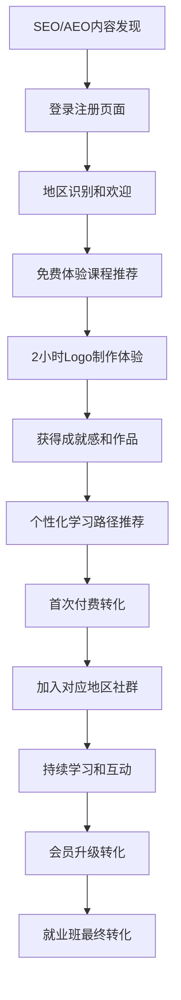

# UAI全球化AI智能设计教育平台产品需求文档（v5-2：技术实现与用户体验）

# 技术架构与实现

## 4.1 前端技术栈

### 4.1.1 核心技术架构

```typescript
// 前端技术栈（简化优化版）
Framework: Vue 3.4+ with Composition API + TypeScript
Build Tool: Vite 5.0+ (构建和开发工具)
UI Framework: Bootstrap 5.3.6 (无其他UI库依赖)
State Management: Pinia (现代化状态管理)
HTTP Client: Axios (统一拦截器和错误处理)
Router: Vue Router 4.x (路由管理)

// 移除的复杂性（相比多语言版本）
❌ OpenCC.js (繁简转换)
❌ Vue i18n (国际化)
❌ hreflang标签管理
❌ 多域名同步机制
```

### 4.1.2 关键实现需求

**性能优化要求**：
- **Core Web Vitals指标**：LCP < 2.5s, FID < 100ms, CLS < 0.1
- **首屏加载时间**：大陆用户 < 1s，海外用户 < 2s
- **代码分割**：路由级别的懒加载，减少初始包大小
- **图片优化**：WebP格式优先，响应式图片加载

**SEO技术实现**：
```vue
<!-- SEO组件系统 -->
<template>
  <SEOHead 
    :title="dynamicTitle"
    :description="seoDescription"
    :keywords="targetKeywords"
    :structuredData="courseSchema"
  />
  <BreadcrumbSEO :breadcrumbs="breadcrumbData" />
  <FAQSection :faqs="courseFAQs" />
</template>
```

**API集成架构**：
```typescript
// src/api/ 完整架构
api/
├── index.ts          // Axios配置和拦截器
├── auth.ts           // JWT认证管理
├── courses.ts        // 课程CRUD操作
├── cart.ts           // 购物车管理
├── orders.ts         // 订单处理
├── membership.ts     // 会员系统
├── analytics.ts      // 数据追踪
├── ai-tools.ts       // AI工具API集成
└── upload.ts         // 文件上传（作品、头像）
```

## 4.2 后端技术栈

### 4.2.1 核心架构

```python
# 后端技术栈
Framework: Django 5.2 + Python 3.12
API Framework: Django REST Framework 3.14+
Authentication: SimpleJWT (JWT令牌认证)
Database: MySQL 8.4+ (生产) / SQLite (开发)
Cache: Redis 7.0+ (会话存储和缓存)
Task Queue: Celery + Redis (异步任务)
File Storage: 阿里云OSS (大陆) + AWS S3 (海外)

# 优化后的架构优势
✅ 统一用户数据管理
✅ 简化的部署和维护
✅ 集中的SEO优化
✅ 高性能缓存策略
```

### 4.2.2 API设计规范

**统一响应格式**：
```json
{
  "status": 200,
  "data": {
    "user": {
      "id": 12345,
      "nickname": "AI学习者",
      "membership_level": "年会员",
      "learning_progress": {
        "completed_courses": 5,
        "total_courses": 12,
        "next_recommendation": "精进专区-字体设计"
      }
    }
  },
  "msg": "获取用户信息成功"
}
```

**关键API端点**：
```python
# Django URL配置
urlpatterns = [
    path('api/auth/', include('apps.users.urls')),
    path('api/courses/', include('apps.courses.urls')),
    path('api/cart/', include('apps.cart.urls')),
    path('api/orders/', include('apps.orders.urls')),
    path('api/membership/', include('apps.membership.urls')),
    path('api/ai-tools/', include('apps.ai_tools.urls')),
    path('api/analytics/', include('apps.analytics.urls')),
]
```

## 4.3 AI工具集成技术实现

### 4.3.1 Adobe Firefly API集成

```python
# Django AI工具服务
class FireflyService:
    def __init__(self):
        self.api_key = settings.ADOBE_FIREFLY_API_KEY
        self.base_url = "https://firefly-api.adobe.io"
    
    async def generate_logo(self, prompt: str, style_options: dict):
        """实时Logo生成"""
        payload = {
            "prompt": prompt,
            "style": style_options,
            "format": "svg",
            "quality": "high"
        }
        
        response = await self.make_api_request("/generate", payload)
        return LogoGenerationResult(
            logo_url=response["url"],
            variations=response["variations"],
            metadata=response["metadata"]
        )
    
    def assess_logo_quality(self, logo_data: bytes) -> QualityScore:
        """AI质量评估"""
        # 调用Adobe AI分析API
        return QualityScore(
            commercial_viability=8.5,
            design_principles=9.2,
            brand_alignment=7.8,
            technical_quality=9.5
        )
```

## 4.4 全球化部署架构

### 4.4.1 单域名全球优化部署

```yaml
# 部署配置
主域名: uaiedu.com
前端部署: Vercel (全球CDN + Edge Runtime)
后端部署: Railway (Django + MySQL)

CDN配置:
  中国大陆: 
    - 阿里云CDN加速
    - 备案域名优化
    - ICP许可证合规
  海外地区:
    - CloudFlare全球节点
    - AWS CloudFront备选
    - 智能DNS解析

数据库: 
  主库: Railway MySQL 8.4 (Global)
  缓存: Redis分布式缓存
  文件存储: 
    - 大陆用户: 阿里云OSS
    - 海外用户: AWS S3

监控体系:
  性能监控: New Relic APM
  错误追踪: Sentry
  用户行为: 
    - 大陆: 百度统计 + 自建分析
    - 海外: Google Analytics 4
```

---

# 用户体验与界面设计

## 5.1 全球化用户体验设计

### 5.1.1 统一设计语言

**视觉设计原则**：
- **简体中文统一**：全平台保持一致的语言体验
- **文化包容性**：设计案例兼顾大陆和海外用户文化背景
- **现代化界面**：Bootstrap 5.3.6为基础的清新现代设计风格
- **响应式设计**：移动端优先，确保全设备良好体验

**交互设计原则**：
- **直观易用**：符合用户操作习惯，减少学习成本
- **反馈及时**：操作结果即时可见，Loading状态明确
- **渐进式披露**：复杂功能分步引导，避免信息过载
- **无障碍支持**：支持屏幕阅读器，键盘导航优化

### 5.1.2 差异化服务体验

**大陆用户体验特色**：
```typescript
// 大陆用户专属功能
const mainlandFeatures = {
  socialIntegration: {
    wechatLogin: true,
    wechatShare: true,
    wechatCommunity: true
  },
  payment: {
    alipay: true,
    wechatPay: true,
    unionPay: true
  },
  content: {
    localCases: true,        // 本土企业案例
    culturalElements: true,   // 中国文化元素
    nationalHolidays: true   // 节假日主题设计
  },
  community: {
    wechatGroups: true,      // 微信学习群
    localMeetups: true       // 线下见面会
  }
}
```

**海外用户体验特色**：
```typescript
// 海外用户专属功能
const overseasFeatures = {
  socialIntegration: {
    discordCommunity: true,
    linkedinShare: true,
    emailMarketing: true
  },
  payment: {
    stripe: true,
    paypal: true,
    applePay: true,
    googlePay: true
  },
  content: {
    crossCulturalCases: true,    // 跨文化设计案例
    internationalBrands: true,   // 国际品牌分析
    localMarketInsights: true    // 当地市场洞察
  },
  services: {
    timezoneSupport: true,       // 时区适配
    multiCurrencyDisplay: true,  // 多币种显示
    internationalShipping: true // 国际物流
  }
}
```

## 5.2 核心用户旅程设计

### 5.2.1 新用户获客旅程



### 5.2.2 关键转化节点优化

**首次访问体验**（0-30秒）：
- 自动识别用户地理位置，显示相关内容
- 清晰的价值主张展示："90天从零基础到接单变现"
- 显著的免费体验入口："立即免费制作第一个Logo"
- 社会证明展示：学员作品、成功案例、用户评价

**免费体验优化**（体验课程期间）：
- 逐步引导完成Logo制作流程
- 实时成就反馈和进度可视化
- AI工具效果的"惊喜时刻"设计
- 体验结束后的成果展示和分享功能

**付费转化优化**（体验后24小时）：
- 个性化的学习路径推荐
- 限时优惠和新用户专属礼包
- 明确的"下一步学什么"指导
- 同期学员的学习进度对比激励

## 5.3 AI功能用户体验设计

### 5.3.1 AI工具交互设计

**Logo生成器界面**：
```vue
<template>
  <div class="ai-logo-generator">
    <!-- 输入区域 -->
    <div class="prompt-input">
      <textarea 
        v-model="userPrompt"
        placeholder="描述您想要的Logo风格，例如：科技感的蓝色Logo，包含闪电元素，现代极简风格"
        class="form-control"
      />
      <div class="style-options">
        <StyleSelector v-model="selectedStyle" />
        <ColorPalette v-model="colorScheme" />
        <IndustrySelector v-model="industry" />
      </div>
    </div>
    
    <!-- 生成按钮 -->
    <button @click="generateLogo" class="btn btn-primary btn-lg">
      <span v-if="!generating">AI生成Logo</span>
      <span v-else>AI正在创作中...</span>
    </button>
    
    <!-- 结果展示 -->
    <div class="generation-results" v-if="logoResults.length">
      <LogoCard 
        v-for="logo in logoResults" 
        :key="logo.id"
        :logo="logo"
        @refine="refineLogo"
        @download="downloadLogo"
      />
    </div>
  </div>
</template>
```

**智能评分系统**：
- 实时质量评分（1-10分）
- 商业适用性分析
- 改进建议自动生成
- 同类型优秀案例推荐

---

# 电商交易系统

## 6.1 购物车与订单系统

### 6.1.1 购物车功能设计

**购物车核心功能**：
```typescript
interface ShoppingCart {
  items: CartItem[]
  subtotal: number
  appliedCoupons: Coupon[]
  finalPrice: number
  
  // 核心方法
  addCourse(courseId: string, quantity?: number): void
  removeCourse(courseId: string): void
  applyCoupon(couponCode: string): Promise<CouponResult>
  calculateTotal(): PriceCalculation
}

// 价格计算逻辑
const priceCalculation = {
  originalPrice: 1299,      // 原价
  memberDiscount: -200,     // 会员折扣
  couponDiscount: -300,     // 优惠券折扣
  finalPrice: 799,          // 最终价格
  savings: 500              // 总节省
}
```

**购物车用户体验优化**：
- 添加商品时的动画效果确认
- 实时价格计算和优惠展示
- 一键清空和批量操作功能
- 购物车内容持久化保存（7天有效期）
- 移动端侧滑操作和手势优化

### 6.1.2 订单支付流程

**支付方式全球化适配**：
```typescript
// 支付方式配置
const paymentMethods = {
  mainland: {
    primary: ['alipay', 'wechatPay'],
    secondary: ['unionPay', 'creditCard'],
    currency: 'CNY'
  },
  overseas: {
    primary: ['stripe', 'paypal'],
    secondary: ['applePay', 'googlePay'],
    currency: 'USD'
  }
}
```

**订单确认页面功能**：
- 商品信息和价格明细确认
- 可用优惠券智能推荐和一键应用
- 支付方式选择和风险提示
- 订单倒计时（15分钟支付限制）
- 发票信息填写和电子发票生成

## 6.2 会员权益系统

### 6.2.1 会员权益管理

**权益体系设计**：
```typescript
interface MembershipBenefits {
  courseAccess: {
    vipCourses: boolean
    downloadPermission: boolean
    offlineViewing: boolean
  }
  
  discounts: {
    regularCourseDiscount: number  // 普通课程折扣
    careerClassDiscount: number    // 就业班折扣
    toolSubscriptionDiscount: number // 工具订阅折扣
  }
  
  services: {
    prioritySupport: boolean       // 优先客服
    personalConsultation: boolean  // 一对一咨询
    portfolioReview: boolean       // 作品集点评
    jobReferral: boolean          // 就业推荐
  }
  
  community: {
    exclusiveForum: boolean        // 会员专属论坛
    monthlyWebinar: boolean        // 月度专家讲座
    networkingEvents: boolean      // 行业交流活动
  }
}
```

### 6.2.2 优惠券策略系统

**优惠券类型和使用规则**：

| 优惠券类型 | 获得方式 | 使用规则 | 有效期 | 防套利机制 |
|------------|----------|----------|--------|------------|
| **注册礼包券** | 完成手机验证 | 7折优惠，首次购买专用 | 7天 | 仅新用户，限用1次 |
| **首课完成券** | 完成首门课程90%+ | 7折优惠，普通课程适用 | 3天 | 限课程完成度验证 |
| **会员权益券** | 购买会员获得 | 数量和有效期与会员等级关联 | 同会员期 | 与会员账号绑定 |
| **积分兑换券** | 积分系统兑换 | 满减券，阶梯式优惠 | 30天 | 积分清零机制控制 |
| **节日活动券** | 活动期间发放 | 限时限量，特定课程适用 | 活动期 | 库存控制 |

**积分系统设计**：
```typescript
const pointsSystem = {
  earning: {
    dailyCheckin: 10,           // 每日签到
    courseComplete: 50,         // 完成课程
    
  },
  
  redemption: {
    coupon_100_10: 100,         // 100积分 = 满100减10券
    coupon_200_25: 200,         // 200积分 = 满200减25券
    coupon_500_70: 500,         // 500积分 = 满500减70券
  },
  
  limitations: {
    maxDailyPoints: 100,        // 每日积分上限
    monthlyRedemptionLimit: 1,  // 月度兑换限制
    yearlyReset: true           // 年底积分清零
  }
}
```

---

# 社区与用户运营

## 7.1 全球化社区建设

### 7.1.1 多平台社区矩阵

**大陆用户社区**：
```typescript
const mainlandCommunity = {
  wechatGroups: {
    beginnerGroup: "Logo设计入门交流群",
    advancedGroup: "AI设计实战进阶群", 
    careerGroup: "设计师就业指导群",
    vipGroup: "会员专属讨论群"
  },
  
  wechatOfficialAccount: {
    contentType: ["教程文章", "行业资讯", "学员作品"],
    publishFrequency: "每周3篇",
    interactionFeatures: ["在线答疑", "作品点评", "活动报名"]
  },
  
  xiaohongshu: {
    contentFocus: ["设计技巧", "学习心得", "作品展示"],
    hashtagStrategy: ["#Logo设计", "#AI设计", "#职业转型"],
    influencerCollaboration: true
  }
}
```

**海外用户社区**：
```typescript
const overseasCommunity = {
  discordServer: {
    channels: {
      general: "General Discussion",
      showcase: "Portfolio Showcase", 
      feedback: "Design Feedback",
      career: "Career Development",
      aiTools: "AI Tools Discussion"
    },
    features: ["语音聊天", "屏幕共享", "文件分享", "机器人助手"]
  },
  
  linkedin: {
    contentType: ["行业观察", "职业发展", "技术分享"],
    networkingEvents: "月度在线meetup",
    thoughtLeadership: true
  },
  
  youtube: {
    contentSchedule: "每周2个视频",
    contentTypes: ["教程", "案例分析", "工具评测", "学员访谈"],
    liveStreaming: "双周直播答疑"
  }
}
```

### 7.1.2 社区运营策略

**内容创作激励机制**：
- **学员作品展示**：每周精选优秀作品在官方渠道展示
- **设计挑战赛**：月度主题设计比赛，获奖者获得课程奖励
- **经验分享奖励**：分享学习心得获得积分和优惠券
- **推荐奖励**：成功推荐新学员获得现金返利

**社区管理规范**：
```typescript
const communityGuidelines = {
  contentPolicy: {
    allowed: ["原创设计作品", "学习心得", "技术讨论", "建设性反馈"],
    prohibited: ["广告推广", "侵权作品", "恶意批评", "政治敏感内容"]
  },
  
  moderationSystem: {
    autoModeration: true,        // AI自动审核
    humanReview: true,           // 人工复审
    reportingSystem: true,       // 用户举报
    appealProcess: true          // 申诉流程
  },
  
  rewardSystem: {
    activeParticipation: "积分奖励",
    qualityContent: "优惠券奖励", 
    mentorship: "会员权益奖励",
    eventOrganization: "现金奖励"
  }
}
```

## 7.2 用户生命周期管理

### 7.2.1 用户分层运营

**用户分层策略**：
```typescript
const userSegmentation = {
  newUsers: {
    definition: "注册后30天内",
    goals: ["完成首次体验", "首次付费转化"],
    tactics: ["新手引导", "专属优惠", "1v1咨询"],
    kpi: ["激活率>60%", "转化率>25%"]
  },
  
  activeUsers: {
    definition: "有付费行为且30天内活跃",
    goals: ["提升学习完成率", "促进会员转化"],
    tactics: ["学习督导", "进度奖励", "社群互动"],
    kpi: ["完课率>70%", "会员转化率>15%"]
  },
  
  vipMembers: {
    definition: "会员用户",
    goals: ["提升满意度", "促进续费", "口碑传播"],
    tactics: ["专属服务", "高级课程", "线下活动"],
    kpi: ["满意度>85%", "续费率>60%", "NPS>70"]
  },
  
  dormantUsers: {
    definition: "30天未活跃的付费用户",
    goals: ["重新激活", "挽回流失"],
    tactics: ["专属优惠", "新课程推荐", "1v1回访"],
    kpi: ["激活率>20%", "回流转化率>10%"]
  }
}
```

### 7.2.2 营销自动化流程

**邮件营销序列**（海外用户）：
```typescript
const emailMarketingFlow = {
  welcomeSeries: [
    {
      trigger: "注册完成",
      delay: "立即",
      subject: "欢迎加入UAI设计学院！开始您的AI设计之旅",
      content: "账户激活 + 免费体验课程推荐"
    },
    {
      trigger: "注册后3天未活跃", 
      delay: "3天",
      subject: "还没开始学习？这里有一些灵感给您",
      content: "学员作品展示 + 学习方法指导"
    },
    {
      trigger: "注册后7天未付费",
      delay: "7天", 
      subject: "限时优惠：新用户专享7折课程",
      content: "个性化课程推荐 + 新用户优惠券"
    }
  ],
  
  engagementSeries: [
    {
      trigger: "课程进度50%",
      subject: "您已完成一半课程！继续加油",
      content: "学习进度展示 + 下一步学习建议"
    },
    {
      trigger: "课程完成",
      subject: "恭喜完成课程！获得您的成就证书",
      content: "电子证书 + 下一阶段课程推荐"
    }
  ]
}
```

**微信营销序列**（大陆用户）：
```typescript
const wechatMarketingFlow = {
  officialAccountFlow: [
    {
      trigger: "关注公众号",
      response: "欢迎消息 + 免费资料包",
      followUp: "新用户专属福利推送"
    },
    {
      trigger: "7天未互动",
      response: "精选教程推送 + 学习群邀请",
      followUp: "个性化内容推荐"
    }
  ],
  
  communityGroupFlow: [
    {
      trigger: "加入学习群",
      action: "群欢迎 + 学习资料分享",
      schedule: "每日打卡提醒 + 答疑时间通知"
    },
    {
      trigger: "作业提交",
      action: "点评反馈 + 优秀作品展示",
      reward: "积分奖励 + 进阶课程推荐"
    }
  ]
}
```